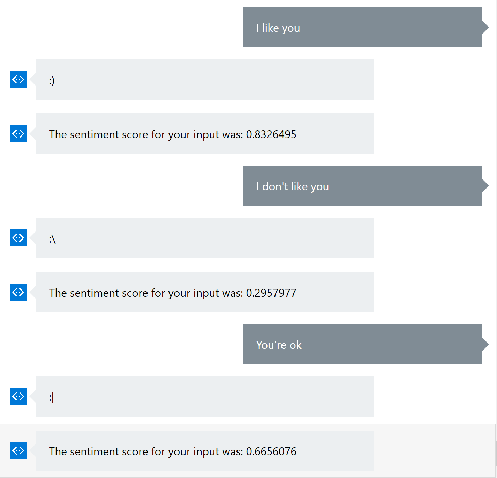

# Using Basic Sentiment Analysis in a Bot

In this demo I demonstrate how to use Microsoft's Text Analytics Cognitive API to inform your bot of a user's emotion. The emotion of a user's input can often determine how the bot's resulting conversation should flow. 
Keep in mind, sentiment score alone should not determine how a bot responds. Messages like "hi" receive a high sentiment score, but should not prompt something like, "That was really nice of you!" from the bot. 

